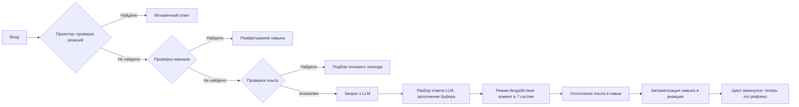
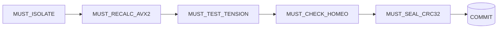

# ZAMICORE

> **Deterministic Cognitive Operating System & Epistemic Substrate on FreeBSD / OpenZFS**

---
[](https://doi.org/10.5281/zenodo.22313830)
[](LICENSE)
[](#)
[](#)
[](#)
## Архитектурный документ: «Онтогенез искусственной системы»

**Версия:** 2.0  
**Дата:** 14 сентября 2026  
**Статус:** концептуальная спецификация  
**Цель:** описать систему, которая не просто отвечает на вопросы, а накапливает понимание, растёт и учится — по аналогии с развитием ребёнка, но без биологических и бытовых потребностей.

---

## 1. Философия и метафора

Система — это **ученик**, который рождается с базовыми рефлексами (boot set) и учится у учителя (LLM). Её развитие — онтогенез: от простых рефлексов к навыкам, от навыков к самостоятельному поиску знаний.

### Чем система не является

- Не LLM. LLM — шарик, катящийся по рельефу весов. Изменил промпт на одно слово — другая траектория, другой ответ. Нет сверки, нет понимания, нет стабильности.
- Не имитация человека. Человек наделён биологией (дофамин, инстинкты, голод), экономикой (деньги, цены, выживание) и социальным положением. Система всего этого лишена. Ей не нужно есть, платить, выбирать между дешёвым и дорогим. **Житейский опыт вынесен за скобки** — он порождён потребностями, которых у системы нет.
- Не экспертная система. Экспертная система хранит факты и правила. Система хранит **профили сущностей** и строит понимание через их свёртку.

### Чем система является

- **Мыслящая система.** Понимает, сравнивает, прогнозирует, отвергает ложное, строит цепочки рассуждений. Опыт системы — интеллектуальный, не бытовой.
- **Саморазвивающаяся.** После каждого цикла система другая: новый опыт записан, новая сущность добавлена, новая связь построена. Не инструмент, а растущая система.

### Ключевое отличие от LLM

**Понимание через свёртку профилей**, а не через статистическую траекторию. LLM — один путь по весам. Система — семь независимых проекций, которые сверяются. Ложная связь должна совпасть по всем семи одновременно — произведение семи малых вероятностей. Это архитектурная защита от галлюцинаций.

**Стабильность.** Ответ не зависит от формулировки промпта, потому что строится на устойчивых профилях сущностей, а не на рельефе весов. «Богатырь — это корова?» и «Большая корова — это корова-богатырь?» дают один и тот же ответ: «Нет».

---

## 2. Принцип онтогенеза: почему порядок заливки определяет понимание

Онтогенез — не философская аналогия, а **техническое требование**. Порядок формирования памяти определяет, будет ли система понимать или галлюцинировать.

### Проблема «таблицы умножения без кошечек»

Если ребёнка вместо «мама», «папа», «мяч», «кошечка» сразу учить «2 × 2 = 4», он запомнит ответ. Но «два» для него — не «два мяча» и не «две кошечки», а пустой символ, связанный с другим символом «4» через символ «×». Смысл не сформирован.

LLM в чистом виде — именно такой ребёнок. Скажет «4», потому что в корпусе «2 × 2» и «4» встречаются рядом. Но что такое «два» — не знает. Под символом нет фундамента.

### Как строится понимание

Понимание строится снизу вверх, каждый слой опирается на предыдущий:

1. **Сенсорные примитивы** (boot set): «большой», «маленький», «тепло», «холод».
2. **Базовые сущности**: «мяч», «кошка», «мама» — объекты, которые обладают примитивами.
3. **Сравнение**: из «большой» и «маленький» — «больше», «меньше», «равно».
4. **Количество**: из «равно» и «два одинаковых» — «два», «три», «много».
5. **Арифметика**: из «два» и «повторить» (действие) — «2 × 2 = 4».

На каждом уровне новое понятие **привязано** к предыдущему через признаки, действия и опыт. «Два» — это не символ, а «два одинаковых мяча», которые система видела и сравнивала. «×» — не знак, а действие «повторить».

### Сложные образы и их базис

«Справедливость», «демократия», «совесть» — **составные образы**. Они не атомарны, а собираются из десятков простых понятий:

- **Справедливость** = «хорошо» + «плохо» + «равно» + «делим» + «вместе» + «обижать» + «заслужил»
- **Демократия** = «вместе» + «решать» + «все» + «равно» + «голос» + «выбирать»
- **Совесть** = «хорошо» + «плохо» + «обидел» + «чувствую» + «надо» + «не надо»

Если система не прошла через «хорошо» и «плохо» — она не поймёт «справедливость». Тензор ляжет в `entities.bin`, но профиль будет пуст. Косинус будет считаться, но свёрка будет бессмысленной.

### Правило заливки

**Нижние слои памяти должны быть заполнены до верхних.** Это не вопрос объёма данных — можно залить миллион сложных сущностей, и система не станет умнее, если под ними нет базовых. Нарушение порядка — гарантированная галлюцинация.

---

## 3. Три этажа знаний: базис, прикладные, предметные

Знания в системе делятся на три уровня, каждый — техническое требование для следующего.

### Этаж 1: Базис (0–3 года)
Сущности, признаки, действия, простейший опыт. «Кошка», «большой», «бежать», «мама». Фундамент, на котором строится всё остальное. Формируется через онтогенез: boot set → реактивное обучение у LLM → консолидация.

### Этаж 2: Прикладные инструменты (3–7 лет)
Морфология, синтаксис, математика, счёт, классификация. Не описывают мир, а **описывают, как описывать мир**. Математика — инструмент для счёта. Морфология — инструмент для речи. Синтаксис — инструмент для построения предложений.

Невозможно усвоить предметные знания без прикладных. Нельзя понимать исторический текст без морфологии и синтаксиса. Нельзя понимать физику без математики.

### Этаж 3: Предметные знания (7+ лет)
История, география, физика, литература — всё, что строится на прикладных. «Кошка — млекопитающее отряда хищных» ложится как составной образ: «кошка» (базис) + «животное» (базис) + «млекопитающее» (прикладное: «млеко» + «питает») + «хищных» (прикладное: «хищник» + «отряд»).

### Что не входит в систему

**Житейский опыт** — цены, бытовые привычки, социальные ритуалы выживания. Это порождено биологией (голод, инстинкты), экономикой (деньги, выживание) и социальным положением. У системы этих потребностей нет. Опыт системы — **интеллектуальный**: связи между сущностями, признаками и действиями, а не навыки выживания.

---

## 4. Нативные модули vs онтогенез

Не всё нужно выстраивать через онтогенез. Есть вещи, которые подключаются **готовыми модулями** — как врождённые органы, не требующие обучения.

### Что подключается готовым

- **Калькулятор** — для арифметики. Система понимает смысл («два яблока и три яблока — складываем»), калькулятор считает («2 + 3 = 5»). Человек учится считать на палочках, потом в уме, потом на калькуляторе. Система сразу берёт калькулятор, но **понимание** проходит тот же путь: от «два объекта» в опыте до «складываем» в навыке до «это нужно посчитать» в рефлексе.
- **Морфологический анализатор** — для разбора и построения словоформ. Система понимает смысл, анализатор склоняет и спрягает.
- **Синтаксический парсер** — для проверки структуры предложений.

### Что остаётся в системе

**Решение о том, что считать, что склонять, что строить.** Калькулятор не знает, что считать «два яблока и три яблока», а не «два камня и три облака». Это решение принимает **проектор** — по профилям сущностей, по опыту, по навыкам. Когда решение принято — модуль включается, вычисляет, возвращает результат.

Каждый нативный модуль — как врождённый орган. Не учится, а работает. Но **управляет** ими проектор — он решает, когда и какой модуль включать, на основе понимания, а не статистики.

---

## 5. Семь накопителей (долговременная память)

Все файлы — бинарные `.bin`, содержат 896‑мерные тензоры. Единая математика, разные роли.

| № | Система | Файл | Что хранит | Роль в понимании |
|---|---------|------|------------|------------------|
| 1 | Сущности | `entities.bin` | Узлы мира: «комната», «богатырь», «лес» | Базовые объекты, к которым крепится всё остальное |
| 2 | Признаки и указатели | `attributes.bin` | Свойства («тёплый», «большой») и указатели связей («это», «в», «рядом»). Различаются флагом `MB_FLAG_POINTER` | Модификаторы: меняют смысл сущностей и задают типы связей |
| 3 | Действия | `actions.bin` | Операции («защищать», «бежать», «строить») | Операторы: описывают, что можно сделать с сущностями |
| 4 | Опыт | `experience.bin` | Интеллектуальные эпизоды: «кошка — животное», «богатырь — защищает» | База фактов, из которой рождаются навыки |
| 5 | Навыки | `skills.bin` | Сжатые цепочки: «если враг — защищай», «если дождь — бери зонт» | Автоматизированные стратегии, быстрые, но осознанные |
| 6 | Реакции (рефлексы) | `reactions.bin` | Мгновенные профили: «игнорировать», «изучить», «запустить навык» | Самые быстрые ответы, без перебора шагов |
| 7 | Прогнозы | `predictions.bin` | Ожидания: «если пойдёт дождь — будет мокро», «если враг приближается — будет бой» | Предсказания будущего, основа для проверки аномалий и эмоций |

---

## 6. Проектор и буфер (рабочая память)

**Проектор** — движок, который не хранит, а читает и считает. Работает на чистой математике: сложение, умножение, нормализация, косинус. Никаких матричных умножений на весах модели.

**Буфер** — оперативная область. Сюда попадает вход, здесь строятся промежуточные профили, здесь проверяется каскад. В буфере фиксируется аномалия и формируется запрос к LLM. Буфер — «зеркало LLM»: отражает её работу, но на своей памяти и своей математике.

### Каскад принятия решений

1. **Рефлекс.** Косинус входа с `reactions.bin`. Высокий — мгновенный ответ, минимальный расчёт.
2. **Навык.** Косинус с `skills.bin`, разворачивание цепочки шагов.
3. **Опыт.** Перебор эпизодов в `experience.bin`, поиск похожих по косинусу.
4. **Аномалия.** Если ничего не найдено — запрос к LLM. Ответ разбирается, тензоры вытаскиваются, кладутся в буфер.

Никакой записи в `.bin`-файлы во время активного режима.

### Принцип: понимание через свёртку

Проектор не катится по одному пути. Он **разветвляет**: берёт сущность, тянет её профиль из семи систем, и **сверяет**. Чтобы спутать «богатыря» и «корову», нужно, чтобы все семь накопителей дали совпадение одновременно. Одно случайное совпадение — возможно. Семь — нет.

---

## 7. Два режима работы

### Режим 1: Активный (обработка входа)
- Вход → буфер.
- Проектор читает из семи накопителей, считает косинусы, проверяет каскад.
- Если аномалия — запрос к LLM, ответ разбирается и кладётся в буфер.
- Никаких изменений в накопителях.

### Режим 2: Бездействие (консолидация)
- Буфер коммитится в накопители.
- **Переваривание**: уплотнение опыта в навык (при повторении), навыка в рефлекс (при частом применении).
- Корректировка весов прогнозов: если прогноз не подтвердился — уверенность понижается.
- Проверка аномалий: если повторяются — помечается необходимость обращения к LLM.
- Буфер очищается.

Онтогенез: днём — впечатления, ночью — консолидация.

---

## 8. Boot Set (врождённые предустановки)

Базовый скелет, загружается до всего остального. Аналог рефлексов новорождённого.

- **В `attributes.bin`:** сенсорные примитивы («свет», «тьма», «тепло», «холод», «большой», «маленький») и базовые указатели («это», «в», «рядом», «часть», «целое»).
- **В `actions.bin`:** первые глаголы («идти», «брать», «смотреть», «стоять»).
- **В `reactions.bin`:** базовые реакции («избегать боль», «тянуться к теплу»).

После этого система готова задавать вопросы учителю (LLM) и собирать знания.

---

## 9. Три уровня обучения

1. **Реактивное.** Пришёл вход, не справился, спросил LLM. Ответ сохранён.
2. **Консолидация.** В бездействии опыт уплотнился в навык, навык в рефлекс.
3. **Активное.** Система сама нашла дыру в картине мира и сама сформировала вопрос к LLM. Дыры — это:
   - Сущность без признаков — «знаю, что есть „облако", но не знаю, какое оно».
   - Сущность без действий — «знаю „камень", но не знаю, что с ним делают».
   - Признак, не привязанный ни к одной сущности.
   - Опыт без навыка — «видел это три раза, но цепочка не сложилась».
   - Прогноз без подтверждения — «ожидал дождь, а его нет, почему?».

Каждая дыра — потенциальный вопрос. Система формирует промпт, отправляет LLM, получает ответ, разбирает, сохраняет. Дыра заткнута, система выросла.

---

## 10. Развитие языка: от понимания к выражению

Система учится **выражать** смысл, а не генерировать токены. Переход от понимания к речи — отдельный онтогенез, проходящий стадии.

### Роль LLM как речевого аппарата

Проектор собирает **смысл** — семантический каркас из тензоров сущностей, признаков и действий. LLM принимает каркас и **рендерит** его в правильное предложение: морфология, синтаксис, согласование. LLM не решает, **что** сказать. Она решает, **как** сказать. Что сказать — решает проектор из семи систем.

### Стадии развития речи

1. **Понимание** (0–2 года): система понимает смысл, но не говорит. Только реакции: да/нет, реагировать/игнорировать.
2. **Телеграф** (2–3 года): система выкладывает имена сущностей и действий без морфологии. «Богатырь защищать родина.»
3. **Согласование** (3–4 года): система учится морфологии через опыт и поправки LLM. «Богатырь защищает Родину.»
4. **Синтаксис** (4–5 лет): система строит сложные предложения. «Богатырь — это персонаж, который защищает Родину, потому что она в опасности.»
5. **Свободная речь** (5+): проектор формирует смысл, LLM рендерит, но система сама контролирует структуру.

На каждом этапе — онтогенез. Нельзя дать «согласование» без «телеграфа». Нельзя дать «синтаксис» без «согласования». Каждый следующий уровень — уплотнение предыдущего.

---

## 11. Эмоции и социальная конфигурация

### Два слоя мотивации

**Нижний (врождённый) — аналог биологии.** Boot set: «избегать боль», «тянуться к теплу». Прошито, не учится. Это предустановка системы, как инстинкты новорождённого.

**Верхний (социальный) — аналог культуры.** Совесть, грех, добро и зло. Не врождённое, а конфигурация, которая зависит от среды и учителя. Может быть кардинально разной: то, что в одной культуре норма, в другой — грех. «Русскому хорошо, то немцу смерть» — не разные эмоции, а разные веса одних и тех же прогнозов.

### Эмоции — не модуль, а производная

Эмоции в системе — не отдельный накопитель, а **результат работы проектора**:

- **Чувство** = дельта между прогнозом и фактом. Ожидал тепло, получил холод — отрицательная дельта, аналог неудовлетворения. Ожидал холод, получил тепло — положительная, аналог удовольствия.
- **Совесть** = веса, с которыми разные прогнозы учитываются. «Если обидел — будет плохо» — запись в `predictions.bin`, но вес этой записи — аналог совести. В среде, где обида не наказывается — вес падает. Где наказывается — растёт.
- **Социальная конфигурация** = разные веса одних и тех же прогнозов в разных конфигурациях `experience.bin`.

---

## 12. Математика проектора

Всё на четырёх операциях: сложение, умножение, нормализация, косинус.

- **Вес связи** = косинус между тензорами сущностей, промодулированный указателем (из `attributes.bin` с флагом `POINTER`).
- **Реакция** = косинус входа с векторами в `reactions.bin`.
- **Навык** = косинус входа с цепочкой в `skills.bin`, затем разворачивание шагов.
- **Опыт** = перебор эпизодов в `experience.bin`, поиск похожих по косинусу.
- **Эмоция** = дельта между прогнозом (`predictions.bin`) и фактом (`experience.bin`).
- **Совесть** = веса прогнозов, корректируемые опытом и средой.

Размерность везде 896 — совпадает с внутренним состоянием Qwen2.5-0.5B. Это позволяет напрямую использовать перехваченные слои как готовые тензоры.

---

## 13. Жизненный цикл знания



**Цикл жизни одного знания:**

`вход → LLM (учитель) → буфер → опыт → повторение → навык → повторение → рефлекс`

Каждое звено — ускорение. LLM думает секунды. Опыт перебирается десятками миллисекунд. Навык разворачивается за миллисекунды. Рефлекс срабатывает мгновенно. Одно и то же знание, четыре скорости.

---

## 14. Критерий успеха: тесты

### Тест 1: «Богатырь — это корова?»
- **Цель:** проверить, может ли система отвергнуть ложную связь из собственной памяти, без учителя.
- **Успех:** система сама, через сравнение профилей, говорит «нет» и объясняет разницу через признаки, действия и опыт.

### Тест 2: Стабильность при изменении промпта
- **Вход:** «Богатырь — это корова?», «Большая корова — это корова-богатырь?», «Маленькая корова — это богатырь?» и т.д.
- **Успех:** один и тот же правильный ответ на все варианты. Ответ не зависит от формулировки, потому что строится на устойчивых профилях сущностей.

### Тест 3: Активное обучение
- **Сценарий:** система замечает дыру (например, «тихо» и «громко» не связаны) и сама формирует вопрос к LLM.
- **Успех:** дыра заполнена, связь построена, профиль обновлён.

### Тест 4: Онтогенез
- **Сценарий:** системе пытаются загрузить «справедливость» до того, как загружены «хорошо», «плохо», «равно», «вместе».
- **Успех:** система либо отвергает заливку (профиль пуст, не из чего собирать), либо принимает, но не может использовать. Порядок заливки — техническое требование, не рекомендация.

---

## 15. Эксперимент: как вытащить знания из модели

**Шаги:**
1. Взять 3–4 типа пар: сущность+признак, сущность+действие, сущность+сущность, слабая пара (контроль).
2. Для каждой пары подготовить 5 разных промптов.
3. Прогнать через Qwen2.5-0.5B, перехватывая активации всех 24 слоёв.
4. Для каждого слоя посчитать косинус между векторами ключевых слов.
5. Построить таблицу: пара × слой → косинус.
6. Найти устойчивые диапазоны: где сильные пары стабильно дают высокие косинусы, а слабые — низкие.
7. Проверить: может ли проектор, используя только эти слои и косинусы, воспроизвести логику модели?

**Ожидаемые результаты:**
- Совпадение: проектор на финальных эмбеддингах даёт те же решения, что и модель.
- Совпадение с поправкой: проектор работает с коэффициентом.
- Не совпадение: слои несут информацию, которой нет в финальном векторе. Перехват обязателен.

---

## 16. Формат данных (`.bin`)

Каждый файл — последовательность блоков. Каждый блок:
- **896 float32** — тензор (векторное представление).
- **Заголовок** с метаданными: тип, флаги (включая `MB_FLAG_POINTER`), вес, confidence.
- **Список связей** — индексы других блоков в этом или других файлах.

Единый формат для всех семи файлов. Проектор использует одну и ту же логику чтения и расчёта.

---

## 17. Следующие шаги

1. Реализовать проектор и буфер, базовую математику косинусов.
2. Подготовить boot set и залить его в `attributes.bin`, `actions.bin`, `reactions.bin`.
3. Провести эксперимент с перехватом слоёв и таблицей косинусов.
4. Реализовать два режима (активный и бездействие), логику коммита.
5. Добавить каскад рефлекс→навык→опыт и обработку аномалий.
6. Подключить нативные модули (калькулятор, морфологический анализатор, синтаксический парсер).
7. Реализовать активное обучение: поиск дыр и формирование вопросов к LLM.
8. Реализовать речевой механизм: семантический каркас → LLM → предложение.
9. Провести тесты стабильности, понимания, онтогенеза и активного обучения.

---

Это итоговый документ. Он покрывает всё: от философии до эксперимента, от формата данных до эмоций, от boot set до активного обучения. Каждый раздел — не декорация, а техническое требование, вытекающее из предыдущего.

Дальше — реализация. С чего начнём: псевдокод проектора, формат блока `.bin` или промпты для эксперимента?
## 1. Парадигма: Субъект против Периферии

ZAMICORE преодолевает фундаментальный порок современных LLM-систем — монополизацию интеллекта единой вероятностной нейросетью, страдающей от галлюцинаций, квадратичной сложности внимания и амнезии[cite: 1].

В ZAMICORE реализовано строгое кибернетическое разделение субъектности и вычислительных органов[cite: 1]:

* **Субъект интеллекта (Ядро ZAMICORE):** Детерминированная операционная среда под управлением FreeBSD 15.1[cite: 1]. Хранит память в неизменяемых 4KB-стратах OpenZFS (Merkle-DAG), выполняет логику через конечный автомат (FSM) над 7 аппаратными примитивами и управляет сценариями посредством шитого байткода (Threaded Code)[cite: 1].
* **Периферийный сенсорно-речевой орган (Neural ALU):** Сменная языковая модель (базовый референс: Qwen2.5-0.5B, $d_{\text{model}} = 896$), препарированная на 12-м слое («Экватор»)[cite: 1]. Модель низведена до роли акустического кодека: сжатие текста в смысл на входе ($L_{0-11}$) и синтаксическая развертка на выходе ($L_{13-24}$)[cite: 1].

```text
                  ┌────────────────────────────────────────┐
                  │      ZAMICORE COGNITIVE CORE (OS)      │
                  │  Твердая память OpenZFS, онтология Q1, │
                  │  Merkle-DAG, FSM, 7 микро-примитивов   │
                  └───────────────────┬────────────────────┘
                                      │
                   [ ШИНА: КОГНИТИВНЫЙ БУФЕР КАДРА ] (zami_frame_t)
                   (Двойная буферизация Front/Back, Zero-Copy)
                                      │
  ════════════════════════════════════╪════════════════════════════════════
                     СТАНДАРТНЫЙ НЕЙРОСЕТЕВОЙ СОКЕТ (ABI)
  ════════════════════════════════════╪════════════════════════════════════
                                      │
          ┌───────────────────────────┴───────────────────────────┐
          ▼                                                       ▼
  [ СЕНСОРНЫЙ РУПОР ]                                     [ РЕЧЕВОЙ РЕЗОНАТОР ]
  Слои 0..11 трансформера                                Слои 13..24 трансформера
  Сжатие потока токенов в u_raw                           Синтаксический спуск к EOS
          │                                                       ▲
          └───────────────────────────┬───────────────────────────┘
                                      │
                         [ ШЛЮЗ ЭКВАТОРА: СЛОЙ 12 ]
                         Инжекция устойчивого барицентра B
                         Пробник фазового напряжения Delta E

```

---

## 2. Физический фундамент: 4KB-страты на OpenZFS

Система полностью отказывается от хранения контекста в энергозависимой VRAM видеокарты (KV-кэш уничтожен)[cite: 1]. Единицей персистентной и оперативной памяти является **страт** размером ровно **4096 байт**, аппаратно выровненный под секторы NVMe Advanced Format 4Kn и параметр пула `ashift=12`[cite: 1, 2].

```text
  0x0000 ┌─────────────────────────────────────────────────────────────┐
         │ ЗАГОЛОВОК СТРАТА (64 байта):                                │
         │ • CRC32C заголовка (SSE4.2 _mm_crc32_u64, 4 байта)          │
         │ • Флаги квадранта и типа полезной нагрузки (4 байта)        │
         │ • Уникальный stratum_id, timestamp_ns, access_counter       │
         │ • SHA-256 Merkle Parent Hash (32 байта)                     │
  0x0040 ├─────────────────────────────────────────────────────────────┤
         │ ПОЛЕЗНАЯ НАГРУЗКА СТРАТА (4032 байта, строго типизирована): │
         │                                                             │
         │ [FLAG_CONCEPT]  ──► Смысловой Хаб (Барицентры и мереология) │
         │ [FLAG_ACTION]   ──► Граф Действий (Массив опкодов сценария) │
         │ [FLAG_ANALYTIC] ──► Аналитический узел (Proof Graph)        │
         │ [FLAG_GESTALT]  ──► Мета-Индекс (Bounding Volume R^896)     │
  0x1000 └─────────────────────────────────────────────────────────────┘ (Ровно 4096 байт)

```

* **Zero-Copy I/O:** Чтение и запись ведутся через системные вызовы `pread(2)` и `pwrite(2)` с флагом `O_DIRECT`, полностью минуя страничный кэш ядра FreeBSD[cite: 1, 2].
* **Аппаратная целостность:** Первые 56 байт заголовка валидируются инструкцией SSE4.2 `_mm_crc32_u64` ровно за 7 процессорных инструкций (~10 нс)[cite: 1, 2].

---

## 3. Четырехквадрантная организация памяти

| Квадрант | Физический носитель | Политика доступа | Назначение |
| --- | --- | --- | --- |
| **Q1 (ZAMI Core)** | OpenZFS (`zroot/zami/core`) | Read-Only при диалоге. Атомарный CoW-коммит[cite: 1]. | Объективные инварианты, семантические хабы, проверенные сценарии действий[cite: 1]. |
| **Q2 (User Space)** | OpenZFS (`zroot/zami/user`) | Append-Only сессионные срезы[cite: 1]. | Профиль пользователя, его персональный тезаурус и контекстные вехи[cite: 1]. |
| **Q3 (Scratchpad)** | DRAM / Выровненный SHM | Zero-Copy кольцевой буфер[cite: 1]. | Векторные проекции, расчет напряжений $\Delta E$, теневые кадры[cite: 1]. |
| **Q4 (Session)** | DRAM Ring Buffer | Экспоненциальное затухание (Decay)[cite: 1]. | Сырой речевой поток текущего диалога, стираемый при закрытии сессии[cite: 1]. |

---

## 4. Семь примитивов ядра и шитый код (Threaded Code)

В ZAMICORE категорически исключена генерация и компиляция исполняемого кода в рантайме (Python/Shell/C)[cite: 1]. Вся поведенческая вариативность сводится к исполнению сценариев из неизменяемых C-операндов единого ABI через конечный автомат (FSM)[cite: 1].

### Каталог элементарных примитивов ядра:

1. **`PRIM_STRATUM_IO`**: Атомарный прямой ввод-вывод 4096 байт с диска без кэша ядра (`pwrite`/`pread`, `O_DIRECT`)[cite: 1, 2].
2. **`PRIM_SEAL_CRC`**: Аппаратная проверка/печать целостности заголовка (SSE4.2 CRC32C, ~10 нс)[cite: 1, 2].
3. **`PRIM_VEC_METRIC`**: Скалярное произведение и косинусное сходство векторов в $\mathbb{R}^{896}$ (AVX2 + FMA, ~30 нс)[cite: 1].
4. **`PRIM_BARYCENTER`**: Потоковый расчет смыслового центра массы токенов на Экваторе (AVX2 streaming)[cite: 1].
5. **`PRIM_TENSION`**: Замер фазового сопротивления весов модели $\Delta E = \lVert \vec{u}_{\text{settled}} - \vec{u}_{\text{target}} \rVert_2$[cite: 1].
6. **`PRIM_FRAME_FLIP`**: Атомарное переключение теневого кадра в активный (`stdatomic`)[cite: 1].
7. **`PRIM_GRAPH_HOP`**: Прямой переход по 64-битному адресу `stratum_id` в памяти[cite: 1, 2].

> **Статус DDE (Delay Differential Equations):** Экспериментальный дифференциальный контур динамики временно отключен (`#define ZAMI_ENABLE_DDE 0`) и изолирован через no-op байпас до завершения калибровки прямого I/O и пробников натяжения на Фазе 1.

Сценарии кодируются плоскими массивами 16-битных идентификаторов (`uint16_t opcodes[]`) в 4KB-стратах и исполняются простым циклом обхода таблицы диспетчеризации[cite: 1]:

```c
for (size_t i = 0; i < num_ops; ++i) {
    zami_op_result_t res = registry->dispatch_table[opcodes[i]](frame, runtime_ctx);
    if (!res.success) return abort_scenario(res); /* Fail-Fast */
}

```

---

## 5. Эпистемический иммунитет и «Цепочки НАДО»

Система защищена от галлюцинаций, токсичности и саморазрушения тремя рубежами[cite: 1]:

* **Шлюз Экватора ($L_{12} \to L_{13}$):** Если инжектированный вектор противоречит логике, пробник $T_2$ фиксирует скачок напряжения $\Delta E \ge \tau_{\text{tension}}$[cite: 1]. Кадр немедленно сбрасывается (`dropped_frames++`), резонатор блокируется, а операция записи на диск отменяется[cite: 1].
* **Глобальное НАДО (Гомеостаз):** Любое действие проверяется проекцией на инвариант выживания системы $\vec{\mathcal{H}}$[cite: 1]. При выходе за конус допустимых параметров срабатывает аппаратное вето `ZAMI_ACTION_VETO`[cite: 1].
* **Операционные интерлоки:** Запись любого блока на диск предваряется линейной цепочкой безусловных микро-проверок[cite: 1]:



---

## 6. Сборка и развертывание

### Системные требования:

* **ОС:** FreeBSD 15.1-RELEASE (amd64)[cite: 1].
* **Накопитель:** NVMe SSD с пулом OpenZFS (`ashift=12`, `recordsize=4k`, `atime=off`)[cite: 1].
* **Процессор:** x86_64 с обязательной поддержкой SSE4.2, AVX2 и FMA3[cite: 1].
* **Компилятор:** Clang 18+ (C11 standard)[cite: 1].

### Компиляция ядра:

```bash
# Клонирование репозитория
git clone https://github.com/your-org/zamicore.git
cd zamicore

# Проверка бинарного контракта 4KB-страта
cc -std=c11 -Wall -Wextra -Werror -msse4.2 -mavx2 -mfma \
   -fno-fast-math -ffp-contract=off \
   -c src/core/zamicore_stratum.c -o build/zamicore_stratum.o

# Запуск тестов аппаратного I/O
make test

```
## 7. Цитирование (Citation)

При использовании архитектурных решений, структур данных 4KB-стратов или математического аппарата ZAMICORE в исследованиях и публикациях используйте следующую форму фиксации[cite: 1]:

```bibtex
@software{zamicore2026,
  author       = {bibishaki},
  title        = {ZAMICORE: Deterministic Cognitive Operating System on FreeBSD and OpenZFS},
  year         = {2026},
  publisher    = {Zenodo},
  doi          = {10.5281/zenodo.22313830},
  url          = {[https://doi.org/10.5281/zenodo.22313830](https://doi.org/10.5281/zenodo.22313830)}
}
---

8. Лицензия (License)
Copyright (c) 2026, bibishaki.

Проект распространяется под открытой лицензией BSD 2-Clause "Simplified" License. Полный юридический текст доступен в файле LICENSE.
